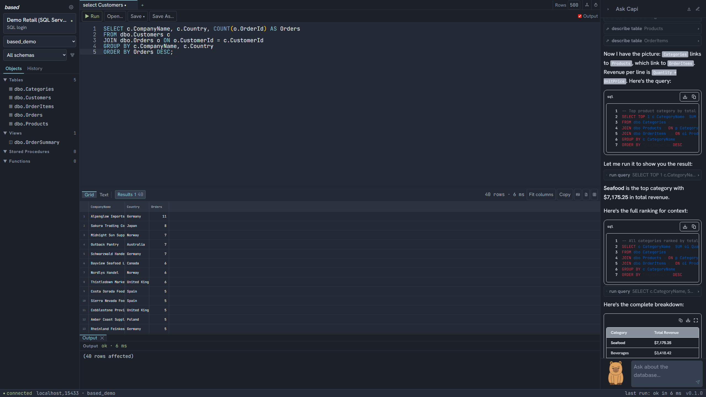
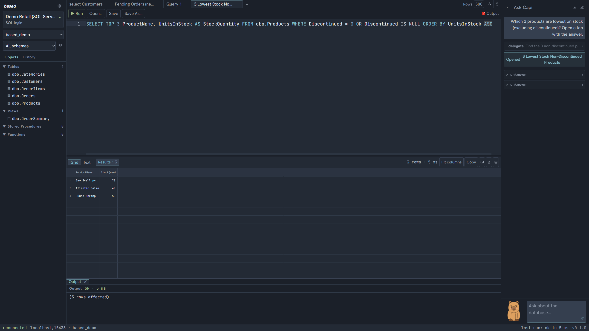
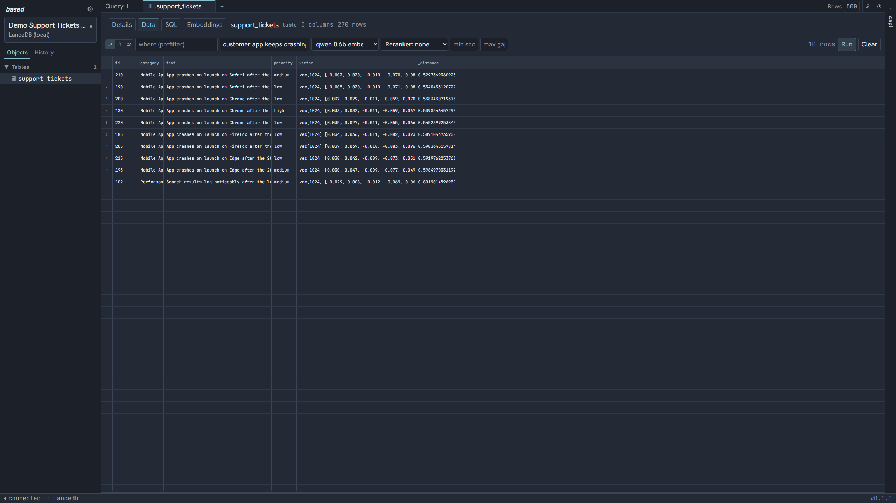
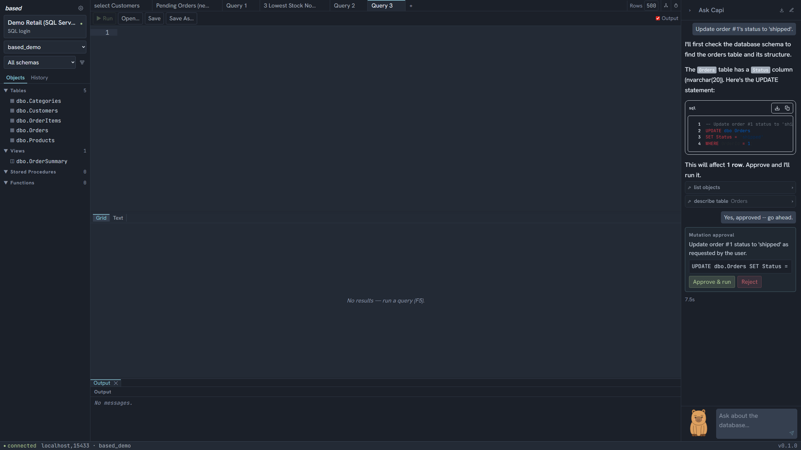
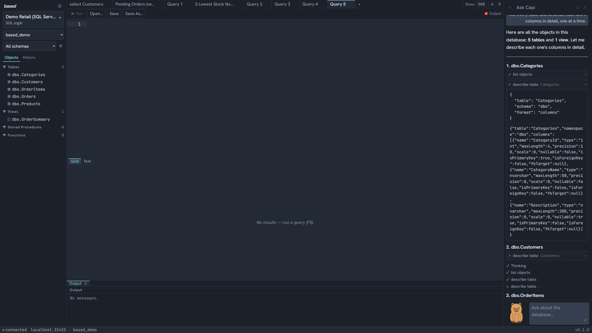
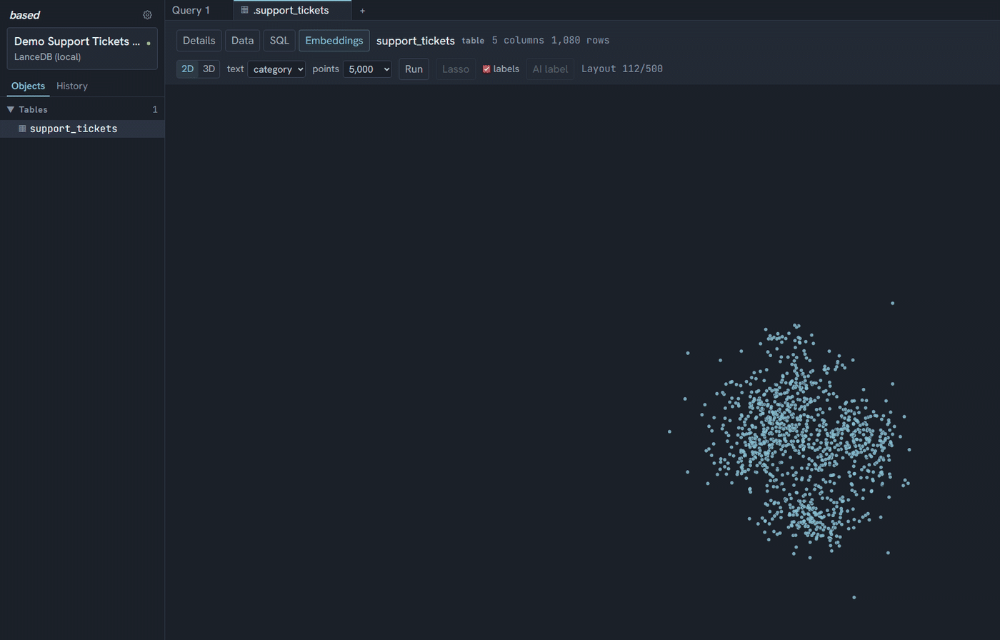
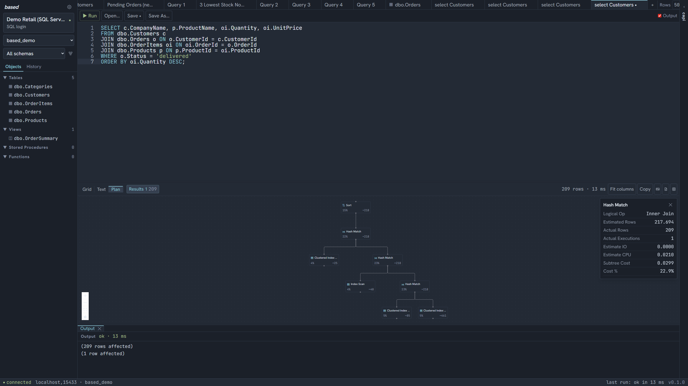
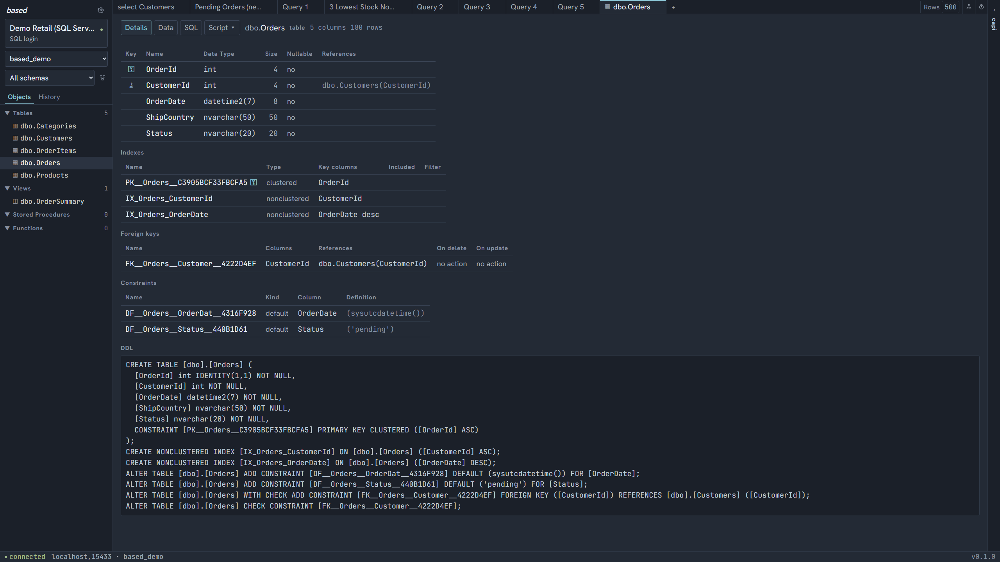
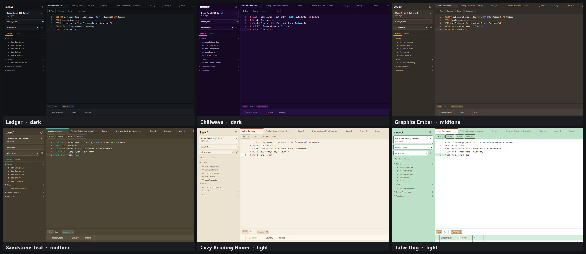

<div align="center">

# based

**A database client where the AI is a participant in your workspace — not a chat box bolted to the side.**

SQL Server, Snowflake, and LanceDB — vector, hybrid, and keyword search included — one workbench,
running entirely on your machine.

[](https://github.com/Cyronius/based/releases/latest)
[](LICENSE)




</div>

---

## Contents

- [Why](#why)
- [What makes it different](#what-makes-it-different)
- [Install](#install)
- [Getting started](#getting-started)
- [Guide](#guide) — connections · editor · grids · tables & schema · execution plans · the agent · LanceDB & search · the Embeddings Atlas · CSV import · themes · multi-window & security
- [Keyboard shortcuts](#keyboard-shortcuts)
- [Status](#status)
- [Built with](#built-with)
- [Development](#development)
- [License](#license)

## Why

Azure Data Studio was retired in February 2026. SSMS is showing its age, DBeaver is a Java app
wearing a lot of hats, and the VS Code migration path asks you to assemble a database client out of
extensions.

LanceDB has it worse — there's essentially no dedicated GUI tooling for it at all. "Working with
your vector store" usually means a Jupyter notebook, a Python REPL, and a lot of manual `pyarrow`
wrangling to see what's actually in a table. based treats LanceDB as a first-class engine, not an
afterthought bolted onto a SQL client: real vector, full-text, and hybrid search with the whole
tuning surface exposed, pluggable reranking, actual SQL over local tables via an embedded DuckDB, and
a full embedding-space visualizer. It's built to be one of the most capable ways to actually *work*
with a LanceDB database, not just query it.

And every tool in either category that does have an AI panel bolts a chat window onto the side,
where the model can see your question but not your work.

based starts from the other end: the agent has tools, reads your open tabs, puts its results in real
grids, and can retrieve and reason over your own vector or database data directly, no
external RAG pipeline required. It still can't write to your database without you clicking Approve.

## What makes it different

### The agent works in the workspace, not beside it

It reads the SQL and results of your **other open tabs**. When it wants to show you something it
**opens a tab** and the rows land in a real, sortable, exportable grid — not as pasted text in a
chat bubble. Ask a follow-up and it already knows what you're looking at.



### A serious LanceDB client — and the agent can RAG it directly

Vector, full-text, and hybrid search run through one pipeline. The search bar exposes the controls
you reach for while exploring — prefilter predicate, embedding and reranker profile, score floor and
score-gap floor, candidate pool and keep size — and the full Lance tuning surface most tools hide
entirely (distance metric, `nprobes`, refine factor, HNSW `ef`, post- vs. prefiltering, bypassing the
ANN index for exact ground truth) is available on the agent's search tools and the local HTTP API.
Reranking is pluggable, including a mode that turns *any* OpenAI-compatible chat endpoint that
returns logprobs — even one with no `/rerank` route, like LM Studio — into a cross-encoder reranker.
Local LanceDB tables get real SQL through an embedded DuckDB, not client-side filtering.

None of that is locked behind manual querying, either — the agent's tool set for a LanceDB connection
*is* `vector_search`, `text_search`, and `hybrid_search`. Ask it a question in plain language and it
retrieves from your own vector store and answers grounded in what it found: retrieval-augmented
generation over your data, with no external RAG pipeline to wire up.



### It cannot write to your database

Read-only is enforced, not requested. Anything that changes data — an `UPDATE`, a CSV import — is a
*proposal* that renders as an approval card; only your click reaches the database, and the endpoint
behind it checks the connection accepts writes at all. Every read the agent performs is written to a
local audit log you can browse.



### The tools are built from what the connection can actually do

Tool *names* are stable across every engine — `read_table`, `count_rows`, `describe_table`,
`get_indexes`, `run_query` — so a conversation stays coherent when you switch connections. What
varies is each tool's parameters and description, generated from the connection's capabilities. A
capability the connection lacks means the tool is **absent**, not present-and-refusing: a LanceDB
Cloud session simply has no `run_query`, a base-folder session gets a `folder` parameter listing
the real folders, and a Snowflake session has no `get_indexes` because Snowflake has no
user-defined indexes to introspect. `get_connection_info` hands the model the whole picture up
front, so it never has to discover a limit by hitting it.



### Your model, your machine

based doesn't ship with a model, or with a runtime, or with any agent profile configured — you add
one yourself in Settings → Agent. A profile is a base URL and a model name, so **anything serving an
OpenAI-compatible `/v1`** works: LM Studio, llama.cpp's `llama-server`, Ollama, vLLM, Unsloth, or a
gateway. If you already run LM Studio with something loaded, pointing a profile at its default
address (`http://localhost:1234/v1`) needs no API key; the others are the same two fields at their
own address. OpenAI, Azure OpenAI, and Anthropic work this way too if you'd rather point at a hosted
model instead.
Connection secrets and API keys live in your **OS keychain** — Windows Credential Manager, or the
macOS login Keychain — never in a config file; core
listens on loopback behind a per-launch token; there is no telemetry. See
[docs/local-models.md](docs/local-models.md) for a local setup that works well on modest hardware.

### See your embeddings

A LanceDB table with a vector column gets an **Atlas**: full-precision vectors streamed in a
zero-copy binary format, reduced through PCA and UMAP in a web worker, and rendered with deck.gl in
2D or 3D. The layout streams as it converges, so you watch the galaxy condense out of noise. Lasso a
region into a grid, find nearest neighbours by cosine similarity, let the model name the clusters.



## Install

**Windows x64.** There is no macOS build to install yet — see [Status](#status).

Download the latest `based-<version>-Setup.exe` from
**[Releases](https://github.com/Cyronius/based/releases/latest)** and run it. Per-user install into
`%LOCALAPPDATA%\Programs\based` — no administrator rights needed.

> **SmartScreen will warn you.** The installer is not code-signed, so Windows shows *"Windows
> protected your PC"* on first run. Click **More info**, then **Run anyway**. Every release publishes
> the installer's SHA-256 in its notes if you want to verify the download first:
>
> ```powershell
> (Get-FileHash .\based-<version>-Setup.exe -Algorithm SHA256).Hash
> ```

Uninstalling leaves your data (`%APPDATA%\based`) and your saved credentials alone.

## Getting started

1. **Add a connection.** Connection selector → *+ New connection*. For Azure SQL, `Azure CLI
   credential` is the least friction if you're already `az login`'d; `Entra ID interactive` opens
   your browser. For Snowflake, it's your account identifier plus a database, with password,
   key-pair, or browser-SSO auth. For LanceDB, point it at a local folder or a `db://` cloud URI.
   **Test connection**, then Save.
2. **Point it at a model.** Gear → **Agent** → add a profile. If LM Studio is running with a model
   loaded, `http://localhost:1234/v1` as the base URL works with no API key — or use any other
   OpenAI-compatible local server (llama.cpp, Ollama, vLLM, Unsloth) at its own address. See
   [docs/local-models.md](docs/local-models.md) for a tuned local setup.
3. **Ask something.** In the right rail: *"what tables are here, and which ones have the most
   rows?"* It will introspect the schema, run an aggregate rather than guessing, and show you.
4. **Run its SQL.** Every SQL block in the chat has **Insert into editor** and **Run**. Press F5 in
   the editor. Results stream into the grid below.
5. **Try a theme.** Gear → **Theme** — 33 of them, applied live with no reload. Dark, light, and
   **midtone**: mid-luminance backgrounds for when near-black and near-white both feel like too much.
   Almost nothing else ships a middle tier.

## Guide

Everything below is real, shipped behavior — each item traces to a numbered requirement in
[specs/based/spec.md](specs/based/spec.md), verified by an executable test or a documented manual
procedure. That file is the authoritative feature list; this section is the readable version of it.

<details>
<summary><b>Connecting — SQL Server, Snowflake, and LanceDB</b></summary>

**SQL Server / Azure SQL**, over an in-process `tedious` driver (no sidecar process), with four
authentication modes:

| Auth mode | How it works |
|---|---|
| **Entra ID interactive** | Opens your system browser to sign in; a local loopback listener captures the redirect |
| **Azure CLI credential** | Reuses your existing `az login` session — no extra prompt |
| **SQL login** | Username + password, stored in the OS keychain |
| **Service principal** | Client ID + secret for automated/service accounts |

Connection metadata (name, server, auth type) is stored locally; the secret itself never touches
that store — it goes straight to the OS keychain, keyed by connection ID, and is deleted when the
connection is.

**LanceDB**, local or cloud:

- **Local** — point at a single LanceDB directory, or at a parent folder containing several. Every
  subfolder that's itself a valid LanceDB is auto-detected and flattened into the object explorer as
  a schema (`folder.table`), and cross-folder joins work through the local SQL engine.
- **Cloud** (`db://slug`) — API key stored the same way as a SQL Server secret, never in the
  connection record.

**Snowflake**, over the official `snowflake-sdk`, with three authentication modes:

| Auth mode | How it works |
|---|---|
| **Password** | Username + password, stored in the OS keychain |
| **Key pair (JWT)** | Paste a PEM private key (for an encrypted key, `{"key": "<PEM>", "pass": "<passphrase>"}`). Also how a service account satisfies Snowflake's MFA policy, which blocks password sign-in |
| **SSO (external browser)** | Opens your system browser to your identity provider — no stored secret at all |

A connection is your account identifier (everything before `.snowflakecomputing.com`) plus a
database, and optionally a schema (default `PUBLIC`), warehouse, and role. Getting the account
identifier's region/cloud half wrong normally surfaces as a bare driver 404 — based rewrites it
into an error that explains the identifier format, since that's the part everyone leaves off.

What a connection can *do* — run arbitrary SQL, accept writes, browse in a defined row order, script
objects, show relations — is captured as a small set of **capabilities**, computed once per
connection and threaded everywhere: the object explorer, the server's route table, and the agent's
tool list all read from the same flags. A read-only LanceDB Cloud connection simply doesn't have a
SQL tab; nothing has to special-case it.
</details>

<details>
<summary><b>Query editor & language servers</b></summary>

Monaco, themed live from the app's own CSS variables (so switching themes restyles the editor, not
just the chrome around it), with real completion and hover from two **in-house language servers** —
built in-house because nothing suitable existed:

- **T-SQL** — completions and hover are driven by your *live authenticated connection*, so alias
  resolution, `schema.`/`alias.` context, and stored-procedure completion all work identically under
  Entra ID, SQL login, or a service principal. An earlier version shelled out to an external `sqls`
  binary; it only worked with SQL logins, so it was replaced.
- **DuckDB / DataFusion** — there was no language server anywhere for this dialect, so based sources
  completions from `sql_auto_complete()` plus `duckdb_tables/columns/functions` against the live
  attached LanceDB catalog, and calls out a column's vector dimension on hover.
- **Snowflake** reuses the T-SQL server's catalog-backed completion — object and column completion
  is dialect-neutral — with Snowflake's keyword list swapped in, so the editor never suggests `TOP`
  or `GETDATE()` on a connection that would reject them.

Both degrade gracefully — if the LSP server is down, refused an upgrade, or times out, the editor
just behaves as if LSP were never wired in. No crash, no stuck spinner.

Query execution: client-side `GO` batch splitting (each batch fails independently — one bad batch
doesn't kill the rest), multiple result sets per run each with their own grid and stats, cancel
mid-query (toolbar button or Ctrl+Break), and real SQL Server error text with line numbers, never a
generic failure. A `Query 3` tab renames itself to something like `select Customers` on its first
successful run, derived from the SQL by a simple tokenizer (deliberately not a full parser).
</details>

<details>
<summary><b>Results grids</b></summary>

Every grid — query results, table data, search results — shares one virtualized, glide-data-grid–based
implementation and one action set:

- **Client-side sort**, 3-state header cycle, type-aware, with SQL-consistent NULL ordering.
- **Per-column filters** with a small mini-language: bare text is *contains*; `=`, `!=`, `>`, `>=`,
  `<`, `<=` are typed comparisons; the literals `NULL` / `NOT NULL` filter on nullness.
- **Resizable, auto-fit columns** with a hover tooltip on truncated cells and a one-click "Fit
  columns" reset.
- **Copy** (tab-separated), **Copy as Markdown** (a real GFM table, pipes escaped), **Save as CSV**,
  and **Open in Excel** — available from the toolbar and from a right-click context menu, both
  selection-scoped. All four are **WYSIWYG**: they read the currently sorted and filtered view, not
  raw arrival order.
- **Safe rendering** for the cell types that crash naive grids: `NULL`, `varbinary` (shown as a
  length + preview, not raw bytes), XML, geography/geometry, and vector columns (`vec[1024] [0.02,
  -0.18, …]`).
- Clickable row numbers for shift/ctrl multi-select.


</details>

<details>
<summary><b>Tables & schema</b></summary>

Double-clicking an object opens a tab with up to four sub-views (configurable which one opens by
default):

- **Details** — every column with its type, size, nullability, and key glyph; indexes (with
  `INCLUDE` lists and filter predicates); foreign keys with their cascade actions; check and default
  constraints; triggers; and a full, server-generated `CREATE` script for the object.
- **Edit Data** — a genuinely editable grid: dirty cells are tinted, rows can be added or deleted, a
  **Review SQL** peek shows the exact parameterized commands about to run, and **Commit** applies
  them as one all-or-nothing transaction. A table with no primary key opens read-only, with a notice
  explaining why. Pending edits block sort/filter with an inline "commit or discard first" — losing
  unsaved edits to a re-sort was judged unacceptable.
- **SQL** — a real query tab, prepopulated with `SELECT * FROM [schema].[table]`, that autoruns once
  and caches its result across sub-view switches.
- **Embeddings** — only on LanceDB tables with a vector column; see the Atlas section below.

A **Script ▾** dropdown gives SSMS-style templates — create / drop / drop-create / alter (modules
only) / SELECT / INSERT — opened into a new tab, never executed automatically. The object explorer
supports multi-select (click, ctrl-click, shift-range) so "Script as" can apply to several objects
at once, joined by `GO`.



**ER diagrams** are their own tab kind: a `dagre`-laid-out canvas with PK/FK glyphs on table nodes
(capped around 25 columns with a "+N more"), FK edges that show a detail card on selection, and a
schema-scope selector. Relations are fetched in one two-recordset batch — no N+1 query storm — and a
schema with more than ~300 tables prompts you to narrow scope first rather than rendering a hairball.
</details>

<details>
<summary><b>Execution plans & client statistics</b></summary>

Toggle "capture actual execution plan" before running a query and the Results pane gains a **Plan**
tab: an interactive, pannable/zoomable operator tree (built on `@xyflow/react`). Click any node for
its detail card — logical/physical operator, estimated vs. actual row counts, estimated IO/CPU,
subtree cost, and predicate. Multi-statement batches get a "Statement 1/2/…" picker.

The same viewer renders **both** SQL Server's ShowPlan XML and DuckDB's JSON query profiles through
one shared operator-tree model — a join plan against Azure SQL and a scan plan against local LanceDB
look and behave the same way. Snowflake has no equivalent plan artifact, so the capture toggle
there tells you to use `EXPLAIN` or `QUERY_HISTORY` instead of pretending.

**Client statistics** (`SET STATISTICS IO, TIME ON`) are available as a separate capture toggle, for
when you want the numbers without the visual plan.
</details>

<details open>
<summary><b>Ask Capi — the agent</b></summary>

Built on an embedded Mastra agent (no server, no cloud dependency — it runs as a plain library
in-process) speaking the AG-UI protocol to the right-rail chat. Providers: any OpenAI-compatible
endpoint (LM Studio by default), OpenAI, Azure OpenAI, or Anthropic, configured as named **profiles**
with their own model, base URL, arbitrary model-parameter JSON, response timeout (default 900s,
sized for a slow local GPU), and a linked instruction set — switching profile switches persona too.

**The tools**, generated from the connection's capabilities so the set and its parameters change with
what the connection can actually do:

| Tool | What it does |
|---|---|
| `list_objects` / `describe_table` | Enumerate schema objects; get a table's columns, or its DDL |
| `read_table` | Paginated row reads, with `where`/`orderBy` on connections that support it |
| `count_rows` | Cheap row counts, used before paging or before proposing a delete |
| `get_indexes` | Index and key metadata for a table |
| `run_query` | Read-only SQL (T-SQL, Snowflake SQL, or DuckDB, depending on engine) — mutations are rejected outright |
| `vector_search` / `text_search` / `hybrid_search` | LanceDB search, with the full tuning surface |
| `script_object` | Generates CREATE/DROP/ALTER/SELECT/INSERT DDL as text — never executes it |
| `sample_rows` / `export_data` | Quick previews; write a CSV/XLSX to Downloads |
| `get_connection_info` | The whole capability picture in one call, so limits are known, not discovered |
| `load_skill` | Pulls a skill's full body on demand — the system prompt advertises only names |
| `run_mutation` *(frontend)* | Proposes an INSERT/UPDATE/DELETE/DDL statement — renders an approval card |
| `import_csv` *(frontend)* | Proposes a CSV import with a preview/mapping card — same approval gate |
| `list_tabs` / `get_tab` / `open_query_tab` *(frontend)* | Reads and opens tabs in your actual workspace |

Two things make this different from a chatbot with function-calling bolted on:

- **Workspace awareness.** Every message carries a snapshot of the active tab (its SQL, its result
  summary) and the list of everything else open, so the agent can answer "what does the query in my
  other tab return" without being told to look.
- **A hard read/write boundary.** `run_mutation` and `import_csv` are *frontend* tools — the model
  can propose, but only your click on the resulting card drives the actual write endpoint, which
  itself checks the connection accepts writes before doing anything.

Runs are capped at 30 tool-calling steps (raised from Mastra's default of 5, which was cutting off
schema audits mid-run) and stream a **live activity feed** — Thinking, then each tool call by name
with a spinner on the one in flight — where every settled step expands to show its full JSON
arguments and result. Conversations are **per-tab threads** that persist across a restart (stored in
a local LibSQL file), and every agent-issued read is written to a local **audit log** you can browse
from the History panel.


Responses stream as markdown (via Streamdown) with Shiki-highlighted SQL blocks — each one carries
**Insert into editor** and **Run** actions — and interactive Mermaid diagrams, including ER diagrams
the agent builds from real query results rather than guessing at row counts.
</details>

<details>
<summary><b>LanceDB search & reranking</b></summary>

Vector, full-text, and hybrid search run through one unified pipeline, in three modes, over two
surfaces.

**In the search bar**, above any LanceDB table: the mode toggle, a `where` predicate (applied as a
*prefilter* — it narrows the candidate set before the ANN search), the query, which embedding and
reranker profile to use, which vector column to search on tables with more than one, a **min score**
and **max gap** floor (both direction-aware, so they mean the right thing whether you're looking at
`_distance` or at relevance), and the reranker's own text column, `top_n`, temperature, candidate
pool, and keep size.

**On `vector_search` / `hybrid_search` and the local `POST /api/session/lance-search` route**: the
rest of the Lance tuning surface, which most tools don't expose anywhere — distance metric
(`l2|cosine|dot`), `nprobes` (IVF partitions to probe: the primary recall/latency dial), refine
factor (re-rank *this*×k candidates against exact vectors), `ef` (HNSW's search-time candidate-list
size — the HNSW equivalent of `nprobes`), a `postfilter` flag to apply `where` *after* the ANN
search instead of before it, `bypassVectorIndex` for an exact ground-truth scan, and engine-side
distance bounds. `nprobes` only bites on an IVF index and `ef` only on HNSW, which is why the agent
is told to call `get_indexes` first — see
[BASED-LANCE-SEARCH-KNOBS](specs/based/spec.md) for the full contract.

**Reranking** is optional and pluggable, via named reranker profiles supporting two API shapes:

- The classic Cohere/TEI `POST /rerank {query, documents}` shape.
- **OpenAI chat-completions yes/no logprobs** — for servers with no `/rerank` endpoint at all, like
  LM Studio. The reranker model is prompted "does this document match the query? answer yes or no"
  and the relevance score is read off the logprobs of the first generated token
  (`P(yes) / (P(yes) + P(no))`). This turns any OpenAI-compatible chat endpoint that returns
  `top_logprobs` into a cross-encoder reranker. Full write-up:
  [docs/local-models.md#reranking](docs/local-models.md#reranking).

Embedding profiles work the same way — named, pointed at any OpenAI-compatible embeddings endpoint —
and a query vector's dimension is checked against the target column before a search runs, so a
mismatched profile fails with a clear message instead of returning nonsense.

Local LanceDB connections additionally get **real SQL** through an embedded DuckDB with the `lance`
extension attached (`ATTACH … TYPE lance`) — genuine predicate pushdown, not client-side
materialization, with its own LSP and execution plan support.

The agent's LanceDB tool set is this same pipeline — `vector_search`, `text_search`,
`hybrid_search`, and `list_search_profiles` are real tools it can call, with the reranker and the
whole tuning surface above available to it. That's what makes retrieval-augmented generation
work out of the box: ask a question, the agent searches your table the same way you would, and
answers from what comes back — no separate RAG pipeline to build.
</details>

<details open>
<summary><b>The Embeddings Atlas</b></summary>

Any LanceDB table with a vector column gets a fourth sub-view: a full visualization of its embedding
space.

Vectors are streamed from the server in a **zero-copy binary wire format** —
`[header length][JSON header][raw float32 block]` — so the client builds a `Float32Array` directly
over the response buffer with no per-value parsing. This is the only read path that bypasses the
usual row cap, bounded instead by a 128 MB byte budget and, for larger tables, even sampling across
the full row range rather than just the first page.

The whole reduction pipeline is **hand-written and dependency-free**, running in a web worker so the
UI never blocks: a seeded PRNG for reproducibility, Johnson–Lindenstrauss random projection, exact
PCA via subspace iteration, UMAP with epochs streamed back as they complete (which is why the layout
visibly *animates* from noise into structure — the "galaxy condensing" effect), k-means++ clustering
with automatic k-selection (Calinski-Harabasz), TF-IDF cluster terms, and cosine-similarity kNN. The
same table with the same seed produces a byte-identical layout every time.


Rendered with deck.gl — a `ScatterplotLayer` in 2D, a `PointCloudLayer` you can orbit in 3D — with
cluster tints, a legend you can click to dim a cluster, and numbered callouts tethered to centroids
by leader lines that stay legible at any zoom. **AI cluster naming** is one `generateText` call
against your active agent profile; if it fails for any reason, the TF-IDF-derived names stay as a
working fallback rather than the feature breaking. Click a point for a detail panel with its full
row and a **Find similar** action (client-side cosine kNN — neighbours ring, everything else dims);
lasso a region in 2D to pull the enclosed rows into a bottom grid panel with the same export toolbar
as everywhere else. Switching to another sub-view doesn't kill the layout worker — only closing the
tab does — so you can flip to the Data tab and back without losing your place.
</details>

<details>
<summary><b>CSV import</b></summary>

Pick a file (native dialog) → columns auto-map by name, with warnings for unmapped `NOT NULL` or
identity targets → a coerced preview highlights per-cell type/parse errors before anything runs →
import streams progress over NDJSON with a running error list → a summary, then the grid reloads.

The parser is a hand-rolled, dependency-free, streaming RFC-4180 implementation. Inserts are packed
as multi-row parameterized statements sized to respect SQL Server's 2,100-parameter limit; imports up
to 5,000 rows commit as one atomic transaction, larger ones commit per-batch, and a "skip bad rows"
option is available for files with known-messy data. When the agent proposes an import, the same
preview/mapping card gates it — approval-only, exactly like a mutation.
</details>

<details>
<summary><b>Themes</b></summary>

33 hand-built themes across three tonal groups — **11 dark**, **11 midtone**, **11 light** — and each
one carries its own **font trio** (display, body, mono), so switching a theme changes the typography,
not only the palette. The midtone group is the one nobody else ships: mid-luminance backgrounds,
tinted rather than neutral, with high foreground contrast — dark and light each commit further than
they need to, and a midtone sits comfortably in a bright room and a dim one alike. Themes retint the
app chrome, the Monaco editor, every data grid, and the
Atlas's WebGL canvas **live, with no reload**, and are painted from a `localStorage` hint before
React even mounts, so there's no flash of the wrong theme on launch.


</details>

<details>
<summary><b>Multi-window, session resilience & security</b></summary>

**Multi-window** (Ctrl+N) with **per-window session restore**: relaunching the app reopens every
window that was still open at last exit — clean quit or a kill — each reconnecting to its last
connection and restoring its tabs, active tab, and schema filter. A window you closed cleanly before
exiting is *not* reopened. Tab persistence is a per-connection **replace**, not an append, so restore
never accumulates stale tabs across sessions.

**Resilient session resume** — if core restarts mid-session (a dev `--watch` reload, or a crash), the
window heals itself instead of hanging: a dropped session is detected either by an SSE push (a status
event for a session that no longer exists) or by any request coming back `409 session-lost`, which
transparently retries after reconnecting. Concurrent triggers collapse into a single in-flight
resume. Switching back to an already-visited connection restores its tabs from an in-memory cache
with no server round-trip, and flushes any unsaved editor edits first rather than discarding them.

**Security posture, concretely:**

- Every secret — SQL passwords, service principal secrets, every provider API key — is stored in the
  **OS keychain** (Windows Credential Manager; the login Keychain on macOS), never in the local app
  database or any config file, and is deleted when its connection or profile is.
- Core listens only on `127.0.0.1`, behind a **bearer token minted fresh per launch**; every request
  needs it.
- The agent gets **schema, not data**, by default — row access only through explicit, row-capped
  tools, and it audits every read locally.
- The agent **cannot write**. `run_query` rejects mutating statements outright; the only path to a
  write is a frontend-rendered approval card that you click.
- Table edits are built as **parameterized commands with identifier validation** — a stray `;`,
  bracket, or quote in a column name is rejected before any SQL is even assembled, and every
  referenced column is checked against the table's real column list first.
- `.sql` file association is registered as an *available* handler only — it never overwrites
  whatever your system already opens `.sql` files with.

Row caps exist at three independent layers so nothing — a runaway `SELECT *`, an agent tool call, an
export — can accidentally pull an unbounded result set into memory: 50,000 rows displayed per result
set (SQL Server keeps counting the true total past that point; DuckDB/LanceDB simply stop scanning),
1,000 rows fetched / 50 previewed back to the agent per tool call, and 100,000 rows per export.
</details>

## Keyboard shortcuts

| Shortcut | Action |
|---|---|
| `F5` / `Ctrl+Enter` | Run the current query |
| `Ctrl+Break` | Cancel the running query |
| `Ctrl+O` | Open a `.sql` file |
| `Ctrl+S` | Save the current tab |
| `Ctrl+Shift+S` | Save as a new `.sql` file |
| `Ctrl+N` | New window |

## Status

**Alpha, and young.** based is useful enough to be a daily driver and is being used as one, but it's
weeks old, not years. Specifically:

- **Windows x64 only, for now.** A macOS (arm64) port is underway and partly landed: per-platform
  data directories ship today, and a macOS CI build produces a `.dmg`. That build has not been
  launched on a Mac yet, and native dialogs, the app menu, Cmd-key shortcuts, and distribution are
  still to do — see [specs/based/plans/macos-port.md](specs/based/plans/macos-port.md). Secrets are
  not a blocker: the keychain layer is already platform-neutral.
- **SQL Server / Azure SQL, Snowflake, and LanceDB.** The engine registry is built for more —
  adding an engine is a descriptor plus an adapter — but these three are what's implemented.
- **The installer is unsigned** — see the SmartScreen note above.
- **No auto-update.** Watch releases, or check the version in the status bar against the latest.
- Expect rough edges, and please [file them](https://github.com/Cyronius/based/issues).

What isn't rough: there are **164 numbered requirements** in
[specs/based/spec.md](specs/based/spec.md), each with either an executable test or a written
verification procedure. If you want to know exactly what's specified to work, that's the file.

## Built with

[Bun](https://bun.sh) · [Tauri](https://tauri.app) · React 19 · Vite ·
Tailwind 4 · [Monaco](https://microsoft.github.io/monaco-editor/) ·
[glide-data-grid](https://github.com/glideapps/glide-data-grid) · [deck.gl](https://deck.gl) ·
[Mastra](https://mastra.ai) · [AG-UI](https://github.com/ag-ui-protocol/ag-ui) ·
[lm-ag-ui](https://github.com/Cyronius/lm-ag-ui) · [tedious](https://tediousjs.github.io/tedious/) ·
[snowflake-sdk](https://github.com/snowflakedb/snowflake-connector-nodejs) ·
[LanceDB](https://lancedb.com) · [DuckDB](https://duckdb.org)

Architecture and the reasoning behind it: [docs/architecture.md](docs/architecture.md).

## Development

```sh
bun install
bun run dev      # core + Vite + native window, all with hot reload
bun test
```

Full setup, dev loops, test configuration, and how releases are cut:
[docs/development.md](docs/development.md) · [CONTRIBUTING.md](CONTRIBUTING.md)

## License

[MIT](LICENSE) © Cyrus Attoun
